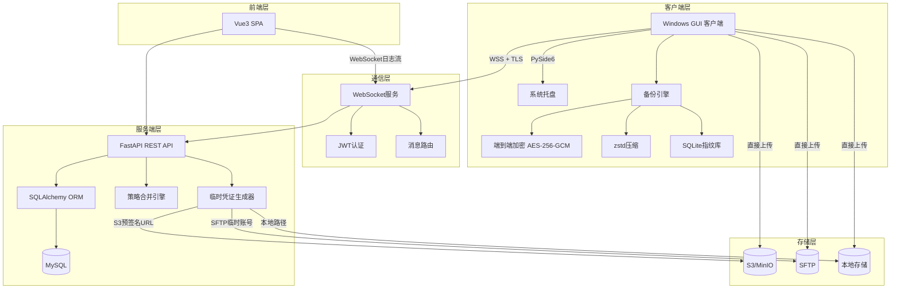

## 产品概述

智能备份与同步系统 v2.0 是一套完整的企业级备份管理解决方案，由服务端管理控制台、Web 管理前端、Windows 桌面客户端三大子系统组成。服务端负责策略管理与客户端监控，客户端执行备份任务并直接上传到存储后端，端到端加密保护数据安全。

## 核心功能

- **客户端管理**：注册、心跳、分组、标签、在线/离线状态监控，支持实时日志推送
- **策略引擎**：分组树向上合并 + 标签优先级合并 + 客户端直接覆盖，生成最终备份策略
- **存储后端管理**：支持 Local/S3/SFTP 三种存储类型，服务端下发临时凭证，客户端直传
- **备份引擎**：增量备份（mtime+size+MD5指纹）、U盘自动备份、大文件分块、断点续传
- **端到端加密**：AES-256-GCM 文件级加密，随机数据密钥+客户端密钥加密存储
- **实时通信**：WebSocket+TLS 长连接，心跳保活，指令下发，日志实时推送
- **版本管理**：客户端版本上传、推送更新、自更新机制（按策略时机）
- **多租户隔离**：用户角色（admin/user），基于用户的数据过滤，标签/分组级权限
- **Web管理界面**：仪表盘、客户端管理、分组树、策略模板、存储后端、版本管理、系统设置

## 技术栈

### 服务端 (FastAPI)

- **语言**：Python 3.10+
- **框架**：FastAPI + Uvicorn
- **ORM**：SQLAlchemy 2.0 (async) + Alembic 迁移
- **数据库**：MySQL 5.7+，开发阶段可选 SQLite 过渡
- **认证**：JWT (python-jose) + bcrypt (passlib)
- **WebSocket**：FastAPI 内置 WebSocket + asyncio
- **验证**：Pydantic v2
- **缓存/队列**：Redis (可选，当前版本通过内存字典管理连接池)

### 前端 (Vue3)

- **框架**：Vue 3 + TypeScript + Vite
- **状态管理**：Pinia
- **路由**：Vue Router 4
- **UI 组件库**：Element Plus
- **图表**：ECharts
- **HTTP 客户端**：Axios
- **WebSocket**：原生 WebSocket API

### 客户端 (Python Desktop)

- **语言**：Python 3.10+
- **GUI**：PySide6 (Qt for Python) + 系统托盘
- **本地数据库**：SQLite (文件指纹、备份meta)
- **加密**：PyCryptodome (AES-256-GCM, RSA)
- **压缩**：zstandard
- **S3**：boto3
- **SFTP**：paramiko
- **WebSocket**：websocket-client
- **打包**：PyInstaller (单文件 EXE)

## 系统架构



## 目录结构

```
system_backup/
├── server/                          # FastAPI 服务端
│   ├── app/
│   │   ├── __init__.py
│   │   ├── main.py                  # 应用入口，FastAPI实例，路由注册，WebSocket端点
│   │   ├── config.py                # 配置管理 (环境变量 + .env)
│   │   ├── database.py              # SQLAlchemy async engine + session工厂
│   │   ├── models/                  # SQLAlchemy ORM模型 (11张表)
│   │   │   ├── __init__.py
│   │   │   ├── user.py
│   │   │   ├── client.py
│   │   │   ├── group.py
│   │   │   ├── tag.py
│   │   │   ├── policy_template.py
│   │   │   ├── policy_assignment.py # client_policy_overrides, group_policies, tag_policies
│   │   │   ├── storage.py
│   │   │   ├── backup_record.py
│   │   │   ├── client_version.py
│   │   │   └── client_log.py
│   │   ├── schemas/                 # Pydantic 请求/响应模型
│   │   │   ├── __init__.py
│   │   │   ├── auth.py
│   │   │   ├── client.py
│   │   │   ├── group.py
│   │   │   ├── tag.py
│   │   │   ├── policy.py
│   │   │   ├── storage.py
│   │   │   ├── version.py
│   │   │   ├── backup.py
│   │   │   └── websocket.py         # WebSocket消息类型定义
│   │   ├── api/                     # REST API 路由
│   │   │   ├── __init__.py
│   │   │   ├── auth.py              # /auth/login, /auth/register, /auth/me
│   │   │   ├── clients.py           # /clients CRUD + 指令下发 + 日志查询
│   │   │   ├── groups.py            # /groups 树形CRUD
│   │   │   ├── tags.py              # /tags CRUD
│   │   │   ├── policies.py          # /policies CRUD + 批量分配 + 生效策略查询
│   │   │   ├── storages.py          # /storages CRUD + 配置验证
│   │   │   ├── versions.py          # /versions CRUD + 文件上传 + 推送
│   │   │   ├── backups.py           # /backups 查询
│   │   │   └── system.py            # /system/status, /system/init-db
│   │   ├── websocket/               # WebSocket 连接管理
│   │   │   ├── __init__.py
│   │   │   ├── manager.py           # ConnectionManager: 连接池、广播、单播
│   │   │   ├── handler.py           # 消息处理：register/heartbeat/log/credential/status
│   │   │   └── router.py            # WebSocket端点 + 消息分发
│   │   ├── services/                # 业务逻辑层
│   │   │   ├── __init__.py
│   │   │   ├── auth_service.py      # 密码哈希、JWT签发/验证
│   │   │   ├── policy_engine.py     # 策略合并引擎（分组树+标签+覆盖）
│   │   │   ├── credential_service.py # 临时凭证生成(S3预签名/SFTP临时账号)
│   │   │   ├── client_service.py    # 客户端注册、状态管理
│   │   │   └── storage_validator.py # 存储后端连接测试
│   │   ├── middleware/
│   │   │   ├── __init__.py
│   │   │   └── auth.py              # JWT中间件 + 多租户过滤
│   │   └── utils/
│   │       ├── __init__.py
│   │       ├── security.py          # bcrypt, JWT工具函数
│   │       └── pagination.py        # 分页辅助
│   ├── alembic/                     # 数据库迁移
│   │   ├── env.py
│   │   └── versions/
│   ├── alembic.ini
│   ├── requirements.txt
│   ├── .env.example
│   └── Dockerfile
│
├── web/                             # Vue3 前端
│   ├── src/
│   │   ├── main.ts                  # 入口
│   │   ├── App.vue                  # 根组件
│   │   ├── router/
│   │   │   └── index.ts             # 路由定义 (8条路由)
│   │   ├── stores/                  # Pinia状态管理
│   │   │   ├── auth.ts              # 用户认证状态
│   │   │   ├── clients.ts           # 客户端列表状态
│   │   │   ├── websocket.ts         # WebSocket连接状态
│   │   │   └── app.ts               # 全局应用状态
│   │   ├── api/                     # Axios HTTP封装
│   │   │   ├── request.ts           # 拦截器 (JWT注入、错误处理)
│   │   │   ├── auth.ts
│   │   │   ├── clients.ts
│   │   │   ├── groups.ts
│   │   │   ├── policies.ts
│   │   │   ├── storages.ts
│   │   │   ├── versions.ts
│   │   │   └── backups.ts
│   │   ├── views/                   # 页面组件
│   │   │   ├── LoginView.vue        # 登录页
│   │   │   ├── DashboardView.vue    # 仪表盘（在线数、最近备份、存储用量图表）
│   │   │   ├── ClientsView.vue      # 客户端列表（搜索、过滤、批量操作）
│   │   │   ├── ClientDetailView.vue # 客户端详情（信息、日志流、备份历史、策略）
│   │   │   ├── GroupsView.vue       # 分组树管理（树形表格、拖拽）
│   │   │   ├── PoliciesView.vue     # 策略模板列表+编辑弹窗
│   │   │   ├── StoragesView.vue     # 存储后端管理
│   │   │   ├── VersionsView.vue     # 版本管理+上传
│   │   │   └── SystemView.vue       # 系统设置
│   │   ├── components/              # 通用组件
│   │   │   ├── AppLayout.vue        # 主布局（侧边栏+顶栏+内容区）
│   │   │   ├── ClientTable.vue      # 客户端表格（排序、分页、多选）
│   │   │   ├── LogStream.vue        # 实时日志流组件（WebSocket）
│   │   │   ├── PolicyAssignDialog.vue # 策略分配弹窗
│   │   │   ├── StorageForm.vue      # 存储配置表单（动态字段）
│   │   │   ├── VersionUpload.vue    # 版本上传（进度条）
│   │   │   └── ConfirmDialog.vue    # 风险操作确认弹窗
│   │   ├── types/                   # TypeScript类型定义
│   │   │   └── index.ts             # 所有接口类型
│   │   └── utils/
│   │       ├── csv.ts               # CSV导出工具
│   │       └── format.ts            # 格式化工具
│   ├── index.html
│   ├── package.json
│   ├── vite.config.ts
│   ├── tsconfig.json
│   └── .env.example
│
├── client/                          # Python桌面客户端
│   ├── src/
│   │   ├── __init__.py
│   │   ├── main.py                  # 入口：初始化QApplication、托盘、WebSocket
│   │   ├── config.py                # 本地配置管理（注册表/JSON）
│   │   ├── gui/                     # PySide6 GUI
│   │   │   ├── __init__.py
│   │   │   ├── main_window.py       # 主窗口（状态概览、任务列表、日志）
│   │   │   ├── tray_icon.py         # 系统托盘（右键菜单、气泡通知）
│   │   │   ├── login_dialog.py      # 登录/绑定用户对话框
│   │   │   └── settings_dialog.py   # 本地设置对话框
│   │   ├── network/                 # 网络层
│   │   │   ├── __init__.py
│   │   │   ├── ws_client.py         # WebSocket客户端（自动重连、心跳、消息路由）
│   │   │   └── message_handler.py   # 消息处理（config_update/credential/command/version）
│   │   ├── engine/                  # 备份引擎
│   │   │   ├── __init__.py
│   │   │   ├── scheduler.py         # 定时调度器（cron/interval/manual）
│   │   │   ├── scanner.py           # 目录扫描 + 变化检测（mtime/size/MD5）
│   │   │   ├── usb_monitor.py       # U盘插入监听（WMI）
│   │   │   └── task_runner.py       # 备份任务执行器（分块读取、流式处理）
│   │   ├── upload/                  # 上传模块
│   │   │   ├── __init__.py
│   │   │   ├── base.py              # 上传器抽象基类
│   │   │   ├── s3_uploader.py       # S3预签名PUT上传
│   │   │   ├── sftp_uploader.py     # SFTP临时账号上传
│   │   │   └── local_uploader.py    # 本地路径复制
│   │   ├── crypto/                  # 加密模块
│   │   │   ├── __init__.py
│   │   │   ├── key_manager.py       # 密钥管理（生成、本地存储、托管选项）
│   │   │   ├── encryptor.py         # AES-256-GCM文件加密/解密
│   │   │   └── compressor.py        # zstd压缩/解压
│   │   ├── storage/                 # 本地持久化
│   │   │   ├── __init__.py
│   │   │   ├── db.py                # SQLite初始化+连接
│   │   │   └── fingerprint.py       # 文件指纹CRUD
│   │   └── updater/                 # 自更新模块
│   │       ├── __init__.py
│   │       └── updater.py           # 下载新版本、校验哈希、替换+重启
│   ├── resources/                   # 静态资源
│   │   ├── icon.ico                 # 应用图标
│   │   └── tray_icon.png            # 托盘图标
│   ├── requirements.txt
│   └── build.spec                   # PyInstaller打包配置
│
├── docker-compose.yml               # 一键部署（MySQL + FastAPI + Nginx + Vue前端）
├── nginx.conf                       # Nginx反向代理配置
└── LICENSE
```

## 实现策略

### 分阶段开发

按照设计文档推荐的10个阶段，合并为7个里程碑逐步实施。每个阶段产出可独立验证的功能模块。

### 关键技术决策

1. **开发阶段使用 SQLite**：降低环境依赖，通过 Alembic 迁移可随时切换 MySQL。生产环境通过环境变量切换数据库URL。
2. **异步优先**：FastAPI 全链路使用 async/await，SQLAlchemy 2.0 async 模式，WebSocket 通过 asyncio 管理连接池。
3. **策略引擎实现**：使用递归向上合并分组树策略 → 按优先级覆盖标签策略 → 客户端 override_config 浅层合并，结果缓存至 Redis/内存。
4. **凭证生成安全**：S3 预签名 URL 有效期 10 分钟，SFTP 临时用户通过 paramiko 在服务端创建并设置目录限制，凭证使用后定时清理。
5. **端到端加密**：文件级加密，随机生成数据密钥(DEK)加密文件内容，DEK 用客户端 KEK 加密后存储在文件头，服务端永不知晓密钥。
6. **前端实时日志**：通过 WebSocket 推送 `log` 消息到客户端详情页，使用虚拟滚动优化大量日志渲染。

## 设计风格

采用**企业级管理控制台**设计风格，深色侧边栏 + 浅色内容区布局。整体视觉以专业、高效、数据密集为导向，适合运维管理场景。

## 页面规划

### 1. 登录页 (/login)

- 居中卡片式登录表单，品牌Logo+系统名称
- 深蓝渐变背景，卡片白色半透明磨砂效果
- 用户名/密码输入框 + 登录按钮，表单验证提示

### 2. 仪表盘 (/dashboard)

- 顶部统计卡片行：在线客户端数、今日备份任务数、存储总用量、告警数（带图标+数字+趋势箭头）
- 中部双图表区：近7天备份量趋势折线图 + 存储类型分布饼图
- 底部最近备份任务列表（表格，显示状态标签）

### 3. 客户端管理 (/clients)

- 顶部搜索栏：搜索框 + 分组下拉筛选 + 标签下拉筛选 + 状态切换Tab
- 客户端表格：UUID、IP、分组、标签、状态指示灯、版本、最后在线时间，支持多选
- 表格工具栏：批量分配分组、批量打标签、批量指令下发按钮
- 点击行进入客户端详情页

### 4. 客户端详情 (/clients/:id)

- 顶部客户端信息卡片（UUID、IP、OS、版本、配置状态）
- Tab切换：实时日志流（WebSocket，终端风格滚动）| 备份历史（表格+分页）| 生效策略（JSON展示）

### 5. 分组管理 (/groups)

- 左侧树形分组结构（可展开/折叠，右键菜单创建/重命名/删除）
- 右侧分组详情：基本信息编辑 + 已绑定策略列表 + 成员客户端列表

### 6. 策略模板 (/policies)

- 左侧策略模板列表，右侧策略详情编辑区
- 策略编辑：备份目录清单编辑器（标签输入）、定时规则配置（cron表达式 + 人类可读预览）、存储目标下拉选择
- 底部分配区域：可视化选择分组/标签/客户端进行策略分配

### 7. 存储后端 (/storages)

- 卡片网格布局，每个存储后端一张卡片（类型图标+名称+状态+配置摘要）
- 新增/编辑弹窗：类型选择radio（Local/S3/SFTP），根据类型动态切换配置表单字段

### 8. 版本管理 (/versions)

- 版本列表表格：版本号、文件名、大小、上传时间、变更日志摘要
- 上传按钮弹出上传对话框（拖拽文件 + 进度条）
- 每行操作：推送更新（选择目标客户端弹窗）、编辑镜像地址、删除

### 9. 系统设置 (/system)

- 数据库状态卡片（连接状态、表统计）
- 用户管理表格（仅admin可见）：创建用户、角色切换
- 系统信息展示（版本、运行时长）

## 布局框架

- 侧边栏（240px）：深色背景（#1d1e2c），Logo+导航菜单（图标+文字），当前页高亮
- 顶栏：面包屑导航 + 用户头像下拉菜单（个人信息/退出）
- 内容区：白色背景，24px内边距，卡片式内容区

## 交互动效

- 侧边栏菜单hover平移动画
- 表格行hover高亮
- 弹窗淡入+缩放动画
- 状态指示灯呼吸动画（在线绿色脉冲）
- 日志流自动滚动到底部